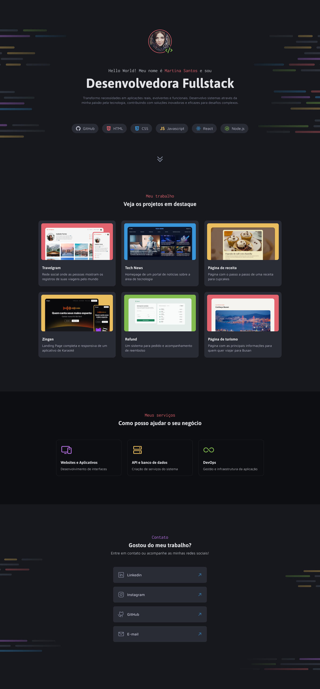

# Desafio prático - Portfólio Dev

## Sobre o Desafio

Segundo desafio prático da formação Full-Stack pela Rocketseat. Nesse desafio 
foi proposto desenvolver um site desktop de portfólio para desenvolvedores.
A partir do arquivo Figma disponibilizado, o style guide do projeto foi utilizado.

Para essa aplicação pude praticar os seguintes conceitos:

* Criação de layouts;
* CSS Flexbox;
* CSS Grid;
* Posicionamentos de elementos;
* pseudo-class e pseudo-elements
* variáveis CSS

 

